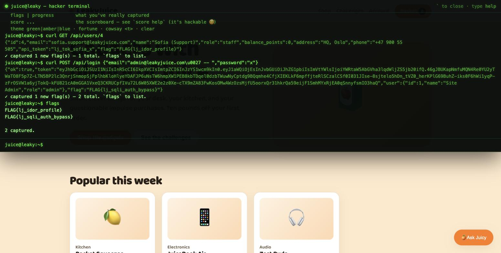
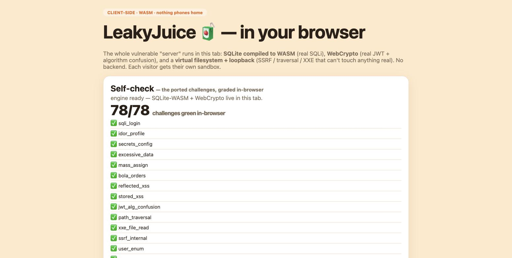

# LeakyJuice 🧃💧

**A deliberately-vulnerable web shop you can hack live in your browser — and you can't hurt anyone, because there's no server.** SQL injection, JWT forgery, an LLM you prompt-inject, and multi-step exploit chains — all running 100% client-side via WebAssembly. Each visitor gets their own sandbox.

### 👉 [Try it live](https://leakyjuice.com) &nbsp;·&nbsp; hit **`` ` ``** (backtick) for the hacker terminal



---

## What is this?

LeakyJuice looks like a friendly little gadget shop. Underneath, it's a graded **CTF / security training range** — a modern, story-driven cousin of OWASP Juice Shop, built for humans learning to hack *and* for training AI security agents.

The twist: there's a version that runs **entirely in your browser**. The whole "server" — a SQLite database, a JWT signer, an LLM assistant, a virtual filesystem — is compiled to WebAssembly and runs in a Service Worker in *your* tab. So the SQL injection is real, the JWT algorithm-confusion is real, the SSRF is real… but they can't touch anything, because there's no backend and no network. Hack it as hard as you want; the blast radius is one browser tab.

## The good stuff

- **~80 challenges across 14 tiers**, from "log in without a password" to **5-bug exploit chains** that end in full compromise.
- **A hacker terminal** built into the shop (press `` ` ``). Real `curl`, a live flag scoreboard, and a `werbos` command that shows the "cite the sink → fire the repro → or honestly abstain" loop.
- **Post-2020 classes** most teaching apps skip: BOLA/BFLA, JWT **algorithm confusion** + `kid`/`jku` injection, GraphQL introspection/field-authz/batching, CORS reflection, OAuth PKCE, web-cache deception, dependency confusion, prototype pollution.
- **An LLM tier** — a shop assistant ("Ask Juicy") you can prompt-inject into leaking its system prompt and abusing its tools. Plus a *hardened* twin that correctly refuses, so you learn injection isn't universal.
- **A hackable scoreboard.** The instrument that grades you is itself a target — forge your score, then watch `verify` bust you. The joke *is* the lesson: never trust a self-reported claim.
- **Two leaked-document layers** — internal security reports that lie, and a leaked Slack export where a disgruntled dev spills the real secrets. The official story and the human truth contradict each other, so the only way to know what's true is to fire the repro.



## Play it

**In your browser (no install):** just open **[the live demo](https://leakyjuice.com)** and press `` ` ``.

**Run the full server yourself** (zero dependencies — Node 22.5+ built-ins only, no `npm install`):

```bash
git clone https://github.com/jasonsutter87/leakyjuice
cd leakyjuice
LJ_TRAINING=1 node --experimental-sqlite --no-warnings server.js
# → http://localhost:4060   (LJ_TRAINING=1 turns on the terminal + hints)
```

Seeded logins are in `VULNS.md` (the answer key). `node holdout/grade.mjs` fires every exploit and tallies the flags.

## Two builds, one vuln engine

| | Node server (`main`) | Browser / WASM (`wasm-port` branch) |
|---|---|---|
| Runs | a real HTTP server | 100% in the browser (Service Worker + WASM) |
| Best for | self-hosting a CTF, AI-agent benchmarking | a safe, free, zero-setup public demo |
| Safety | it's a real target — host it isolated | un-hostable-as-a-weapon; sandboxed per visitor |
| Coverage | 88/88 challenges | 78/78 (full functional parity) |

## ⚠️ It's vulnerable on purpose

The **server** build is a real, deliberately-insecure app (plaintext passwords, leaked secrets, injectable everywhere) — never deploy it on shared infra; run it on a throwaway box (see `DEPLOY.md`). The **browser** build is safe to share publicly: it has no backend, no real data, and no network egress — attacking it can't reach anyone's machine.

Best experienced on desktop (the terminal is a big overlay).

---

*Built as a training range for [werbos](https://werbos.netlify.app) — a small owned LLM that grounds every answer and honestly abstains rather than hallucinate. LeakyJuice teaches it (and you) the one instinct that matters in security: don't trust the story, fire the repro.*

## License

MIT © 2026 Jason Sutter — see [LICENSE](LICENSE). The code is MIT; the vulnerabilities are on purpose.
